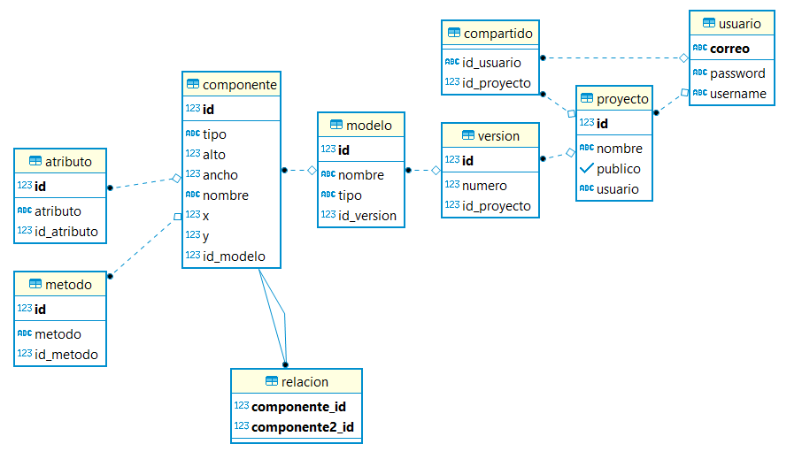
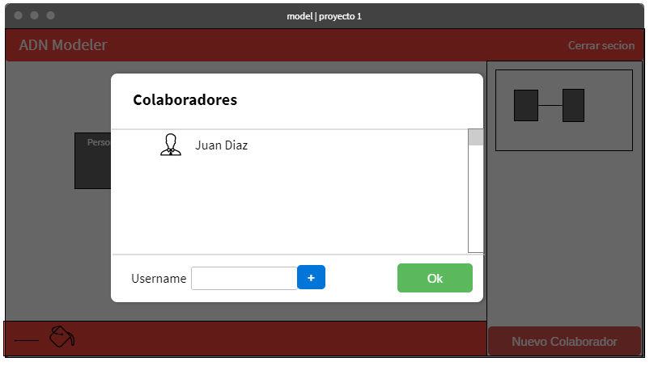
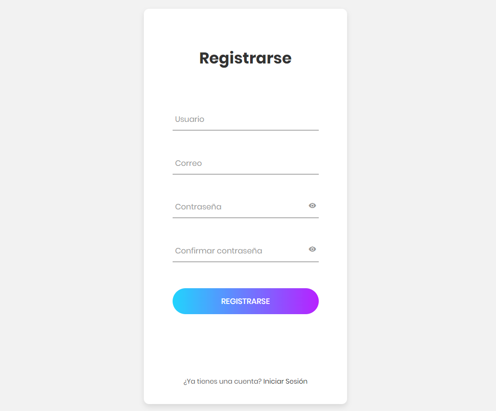
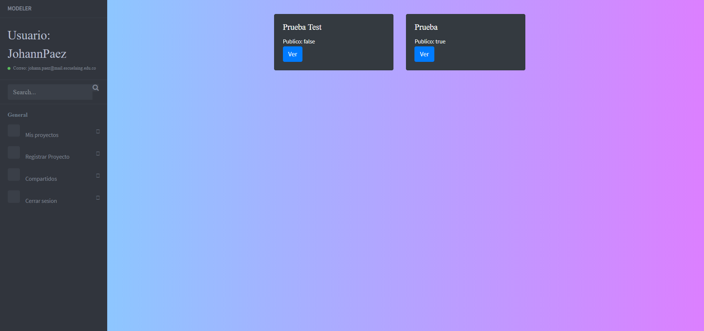
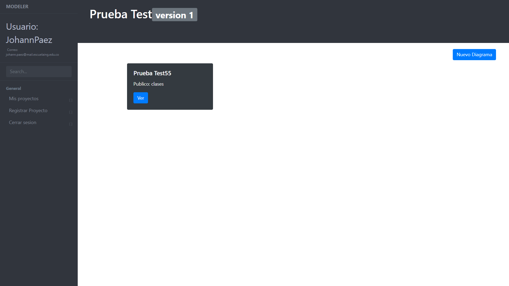
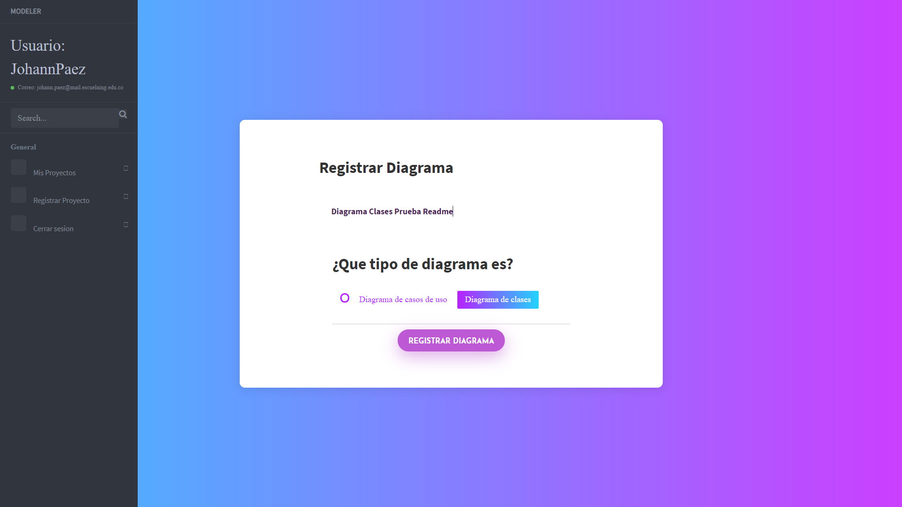
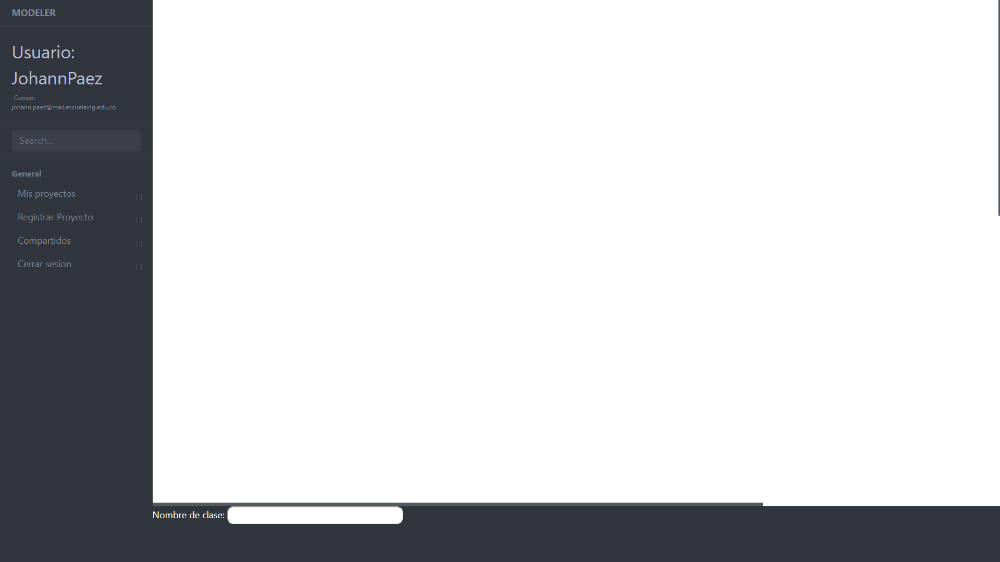
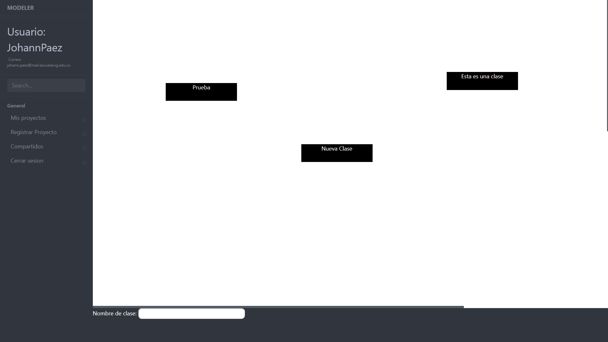

# Proyecto ARSW
## Integrantes:
- Jeisson Sanchez
- Johann Paez
- Juan Camilo Rojas

[CLASS MODELER LINK](https://class-modeler.herokuapp.com/)

[Requerimientos no funcionales](https://github.com/ARSW-Project-2020-think/modeler/wiki/Escenarios-No-Funcionales)

## Credenciales de base de datos

Host: ec2-184-72-235-80.compute-1.amazonaws.com

Base de datos: d7huo5cps0ots

usuario: lyvcjuynzppnyh

puerto: 5432

password: 2c339db0592217044fe134f20addfbfe1e798c0412a62b31433b650464157f59

### Problema:

En muchas ocasiones los desarrolladores de software o personas con necesidades similares utilizan los diagramas UML para modelar una solución a un problema. Esto en ocasiones es tedioso puesto que solo una persona puede realizar el trabajo, puede ser extenso y se tiende a cometer errores. También si se está con un compañero, esa persona sólo puede observar mientras se realiza el diagrama, al trabajar más de una persona al tiempo, es necesario compartir el archivo para que la otra persona continúe y haga su parte. El problema radica en que no se puede trabajar al tiempo, ya que, si se hace, es necesario unir los dos proyectos manualmente y esto puede ser peor ya que genera más desorden.

### Propuesta:

Proponemos una herramienta que busca que los desarrolladores de software y demás personas puedan realizar un desarrollo colaborativo de su modelado, permitiendo trabajar conjuntamente en el mismo proyecto, disminuyendo tiempos, aportando sus propias ideas y controlando mejor los errores. La herramienta contará con un manejo de versiones para hacer una mejor gestión acerca de la manera en que desarrollamos el software, evitándonos los problemas que tiene los softwares offline.

### Funciones:
- Añadir un colaborador para trabajar concurrentemente en el mismo proyecto.
- Registrar un cambio para tener un mejor control de quien lo realizo.
- Visualizar todos los proyectos de manera agradable para el grupo de trabajo.
- Un sistema de control de versiones que permita retomar el proyecto sin necesidad de cargarlo previamente.

## Diagrama de clases

## Casos de uso

**Registrar Proyecto**

COMO usuario QUIERO registrar un proyecto PARA PODER empezar mis modelos de diagramas de clases y casos de uso

**Consultar un proyecto**
 
COMO usuario QUIERO consultar un proyecto PARA PODER saber en que estado esta, que me falta y que debo mejorar.

**Registrar un versión**

COMO usuario QUIERO registrar una version PARA PODER tener un control de los cambios que voy a realizar a mis proyectos	

**Consultar una version**

COMO usuario QUIERO consultar una version PARA PODER
recuperar algo que necesite de esta version

**Registrar un colaborador**

COMO usuario QUIERO registrar un colaborador PARA PODER trabajar en equipo en mi proyecto

**Consultar colaboradores**

Como usuario quiero consultar los colaboradores para saber quienes tiene derecho a modificar mi proyecto

**Registrar un modelo**

COMO usuario QUIERO registrar un modelo PARA PODER realizar el diagrama que necesite

**Consultar un modelo**

COMO usuario QUIERO consultar un modelo PARA PODER saber los cambios que debo a hacerle al mismo y/o añadirle mas cosas

**Registrar linea**

COMO usuario QUIERO registrar una linea PARA PODER generar relacion entre los diferentes compotenes de algun modelo

**Registrar usuario**

COMO usuario QUIERO registrar un usuario PARA PODER poder administrar mis modelos

**Consultar usuario**

COMO usuario QUIERO consultar un usuario PARA PODER añadir colaboradores a mis proyectos.

**Registrar rectangulo**

COMO usuario QUIERO registrar un rectangulo PARA PODER representar un concepto en un modelo. 

**Registrar ovalo**

COMO usuario QUIERO registrar un ovalo PARA PODER representar un caso de uso

**Registrar actor**

COMO usuario QUIERO registrar un actor PARA PODER realizar un buen diagrama de casos de uso

## Diagrama entidad-Relacion

## Diagrama de componentes

## Diseño interfaz graficaño
**Vista de registro**

**Vista de login**

**Vista de proyectos**

**Crear Diagrama**

**Vista diagrama**

**Vista editar Clase**

**Vista Colaboradores**

## Diagramas de Secuencia

[Diagramas de Secuencia](img/Secuencia)

## Taiga

[Link](https://tree.taiga.io/project/jeisonsr43-modeler/timeline)

## Funcionamiento de la Aplicación

Al entrar a la aplicación lo primero que vemos es la opción de iniciar sesión, que da la posibilidad de reegistrarse en caso de que no se tenga una cuenta creada.

Una vez se haya iniciado sesión, podemos observar que la página principal tiene una barra de navegación lateral a la izquierda que le permitirá al usuario desplazarse a las diferentes funcionalidades de la aplicación.

**"Mis proyectos"** muestra todos los proyectos públicos y privados del usuario que inició la sesión.

Nos da la opción de **"ver"**, que será descrita **posteriormente**.

**"Registrar Proyecto"** nos muestra una vista agradable al usuario en la que puede elegir el nombre del proyecto y su visibilidad **(público o privado)**.

Una vez le demos en la opción **"ver"** descrita **anteriormente** o se registre un nuevo proyecto, automáticamente nos redireccionará a la página del proyecto, en la cual se puede ver los diagramas existentes y crear nuevos diagramas.

Nos da la opción de **"ver"**, que será descrita **posteriormente**.

Al darle click en **"Nuevo Diagrama"** le da la posibilidad al usuario de crear un nuevo diagrama de clases o un nuevo diagrama de casos de uso con su respectivo nombre.

Una vez le demos en la opción **"ver"** descrita anteriormente o se registre un nuevo diagrama, automáticamente nos redireccionará a la página del modelo, dónde podemos agregar nuevas clases con su respectivo nombre.

Una vez hayamos escogido el nombre apropiado para nuestra clase, sólo basta con dar **click** en el lugar deseado dónde queremos que aparezca el rectángulo y listo. 

**A crear nuestro diagrama!**

